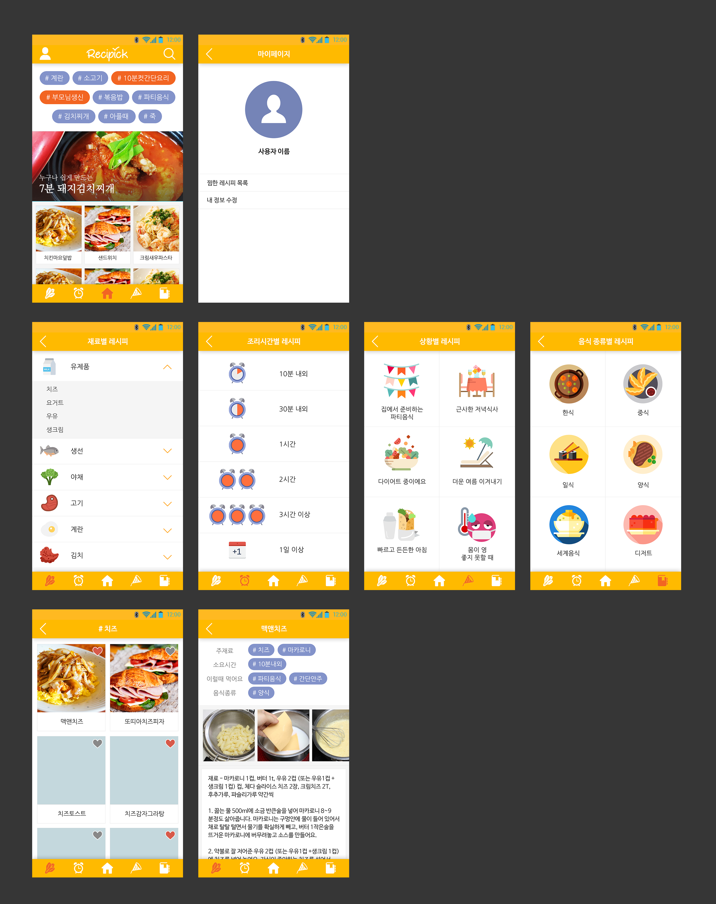

# ChefKim

팀명 : 김셰프
주제 : 태그로 분류하는 레시피 애플리케이션

인스타그램에서 #고양이 를 검색하면 고양이 사진이 나오는 것처럼, 레시피를 주재료/소요시간/먹는 상황/음식 종류에 따라 태그로 분류하여 "냉장고에 이런 재료가 있는데, 이걸로 뭘 만들지?" 또는 "이런 상황에서는 어떤 음식을 먹지?" 와 같은 질문에 대해 적절한 레시피를 찾을 수 있도록 해줌!

=======
- 재료별 레시피
  - 유제품
    - 치즈
    - 요거트
    - 우유
    - 생크림
  - 해산물 (플로우차트 이미지 오타)
    - 생선
    - 조개
    - 오징어
  - 야채
    - 쌈채소
    - 호박
    - 감자
    - 고구마
  - 고기
    - 소고기
    - 돼지고기
    - 닭고기
  - 계란
  - 김치
  - 밥
  - 과일
- 조리시간별 레시피
  - 10분 내외
  - 30분 내외
  - 1시간
  - 2시간
  - 3시간 이상
  - 하루 이상
- 상황별 레시피
  - 집에서 준비하는 파티음식
  - 근사한 저녁식사
  - 다이어트 중이에요
  - 더운 여름 이겨내기
  - 빠르고 든든한 아침
  - 몸이 영 좋지 못할 때
  - 간단 안주 모음
  - 집밥 생각나는 백반
  - 당충전이 필요해
  - 부모님 생신상 차리기
- 음식 종류별 레시피
  - 한식
  - 중식
  - 일식
  - 양식
  - 세계음식
  - 디저트

**필요한 기술**  

1. 서버 구현   
2. 델리게이트 (서버 구현) 
3. 모달 (마이페이지, 서버 구현시 - 레시피 제보)
4. 상단 네비게이션 & 하단 탭 바
5. 테이블, 콜렉션, 아코디언 메뉴